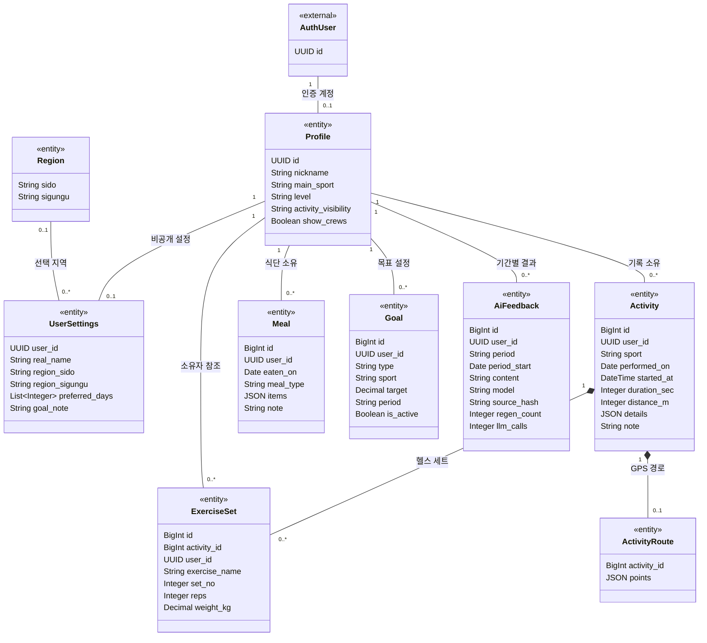
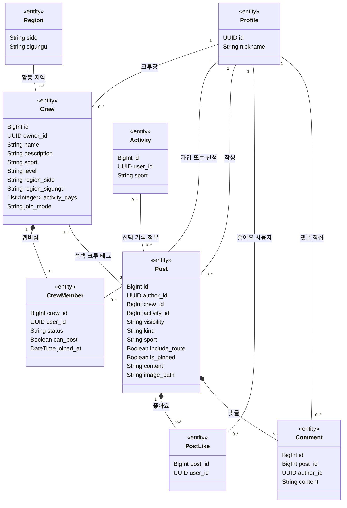
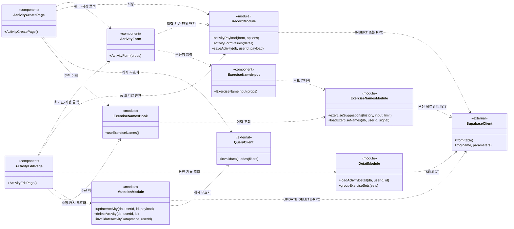

# CrewFit 클래스 다이어그램

기준일: 2026-09-16. [설계 결정](decisions.md), [스키마](schema.md), [스키마 적용본](../../server/config/schema.sql), 현재 코드의 책임·관계를 UML 클래스 표기로 정리했다.

## 1. 읽는 방법과 범위

이 프로젝트는 Java 클래스 계층이 아니라 React 함수 컴포넌트·JavaScript 모듈·PostgreSQL로 구성된다. 따라서 **2~3절은 도메인 클래스 모델**, **4절은 실제 함수 모듈을 클래스 표기로 표현한 구현 모델**이다. 실제로 존재하지 않는 Controller·Repository 클래스를 구현된 것처럼 추가하지 않았다.

- `<<entity>>`: DB에 저장되는 도메인 객체. 필드는 주요 항목만 표시하고 생성·수정 시각 등은 생략한다.
- `<<external>>`: Supabase가 관리하는 외부 모델 또는 SDK.
- `<<component>>`, `<<module>>`: 함수 컴포넌트 또는 모듈. `+함수명()`은 실제 함수·공개 진입점을 나타내며 클래스 메서드가 있다는 뜻은 아니다.
- `1`, `0..1`, `0..*`: 한 개, 선택 한 개, 여러 개 관계다. `*--`는 자식의 생명주기가 부모에 종속되는 합성, `--`는 연관, `..>`는 사용 의존이다.
- nullable 필드는 아래 설명에서 구분한다. UML의 접근 표시 `+`는 RLS 공개 권한을 뜻하지 않는다.
- 도메인 모델에는 스키마에 정의되었지만 화면·API가 미구현인 식단·목표·AI·크루·피드·GPS도 포함한다. 구현 상태의 단일 기준은 [decisions.md](decisions.md)의 진행 상황이다.

## 2. 회원·개인 운동·코칭 도메인

### 모델과 저장 구조

| 클래스 | 저장 위치 | 핵심 제약·의미 |
|---|---|---|
| AuthUser | `auth.users` | 인증은 Supabase 관리. 앱 프로필에 비밀번호를 저장하지 않는다 |
| Profile | `profiles` | 로그인 전원이 읽는 카드. 실명·지역·목표 메모는 포함하지 않는다 |
| UserSettings | `user_settings` | 본인 전용. real_name·지역·goal_note는 NULL 허용 |
| Region | `regions` | `(sido, sigungu)` 복합 키. 설정의 지역 두 값은 함께 비거나 함께 채운다 |
| Activity | `activities` | 6종목 공통 모델. 종목·소유자 불변, 시간은 초, 거리는 m |
| ExerciseSet | `exercise_sets` | 헬스 부모만 허용. `(activity_id, lower(exercise_name), set_no)` 유일 |
| ActivityRoute | `activity_routes` | 활동당 최대 한 경로. 러닝·걷기·자전거만 허용 |
| Meal | `meals` | 음식 목록은 items JSON. 별도 음식 마스터 테이블 없음 |
| Goal | `goals` | count·distance·duration × week·month. sport NULL은 전체 종목 |
| AiFeedback | `ai_feedbacks` | `(user_id, period, period_start)` 유일. 결과 쓰기는 서버 admin만 |

### 관계 해석 시 주의

- 가입 트리거는 Profile·UserSettings를 함께 만든다. 그림의 `0..1`은 FK만으로 역방향 행 존재까지 강제하지 않는 점을 표현한 것이며, 정상 가입 이후에는 각각 한 행이 존재한다.
- Activity 하나에 모든 종목을 표현한다. RunningActivity·GymActivity 등의 상속 클래스를 현재 구조에 임의로 만들지 않았다(D-03·D-04).
- 세트는 전체 모델에서 `0..*`다. 현재 헬스 생성·수정 폼은 1~100세트를 요구하지만 모든 종목에 세트가 필수인 것은 아니다.
- ExerciseSet.user_id는 자동완성·RLS용 비정규화 필드다. 별도 소유자를 뜻하지 않으며 부모 활동 소유자와 일치해야 한다.
- Activity.started_at·distance_m·note, ExerciseSet.reps·weight_kg는 NULL을 허용한다. 수영 랩 수는 별도 클래스가 아니라 `Activity.details.lap_count`다.
- 활동 삭제 시 세트·경로는 함께 삭제된다. AiFeedback은 활동과 FK로 연결되지 않는 기간별 생성 결과다. 이후 요청의 해시 비교로 입력 변경을 판단한다.
- 실명은 본인과 해당 크루의 크루장만 제한적으로 조회한다. 크루장은 `crew_member_names` RPC로 approved 회원의 user_id·real_name만 받는다(D-28).

## 3. 크루·피드 도메인

Profile·Activity·Region은 2절과 같은 클래스이며 관계를 읽기 위해 다시 표시했다. 아래는 스키마·ADR 기준 모델로, 크루·피드 화면/API의 구현 완료를 뜻하지 않는다.

### 관계·권한 제약

- Crew.owner_id는 크루마다 한 명이다. 별도 ‘크루장 사용자 클래스’가 아니라 Profile이 크루별로 맡는 역할이다. 생성 트리거가 크루장의 approved·can_post 멤버십도 만든다(D-17).
- CrewMember는 사용자와 크루의 다대다 관계를 풀어낸 연결 객체다. `(crew_id, user_id)`가 키이며, status는 pending 또는 approved다. 그림의 `0..*`에는 둘 다 포함된다.
- Crew.join_mode는 open 또는 approval이다. 회원 자격과 글쓰기 권한은 별개이며, 일반 승인 회원의 can_post는 기본 false다.
- Post.crew_id·activity_id·sport·image_path는 NULL을 허용한다. visibility가 crew이면 crew_id가 필수이며, include_route가 true이면 activity_id가 필수다.
- 크루 삭제 시 태그된 게시글은 public 글을 포함해 삭제된다. 활동 삭제 시 게시글은 남고 activity_id가 NULL, include_route가 false가 된다.
- PostLike의 키는 `(post_id, user_id)`다. 댓글은 한 단계이며 대댓글 부모 필드는 없다.
- 사진은 별도 앱 엔티티가 아니라 비공개 Storage 버킷의 객체를 image_path로 참조한다. 일반 FK가 아니므로 저장소 객체와의 합성 관계를 그리지 않았다(D-26).
- 공개 프로필의 기록 공개 범위와 GPS 경로 공개는 다르다. 타인은 본인이 볼 수 있는 게시글에 include_route로 첨부된 경우에만 경로를 읽는다(D-19·D-23).

매핑: Crew → `crews`, CrewMember → `crew_members`, Post → `posts`, PostLike → `post_likes`, Comment → `comments`.

## 4. 기록 기능의 구현 클래스 표기 — 실제 코드 기준

2~3절의 엔티티 객체가 스스로 DB를 저장하는 구조는 아니다. 현재 기록 기능은 폼·페이지가 흐름을 제어하고, 함수 모듈이 검증·조회·변경을 담당한다. 다음 함수의 인자는 가독성을 위해 축약했다.

| 도식 이름 | 실제 코드 |
|---|---|
| ActivityCreatePage / ActivityEditPage | [생성 페이지](../../client/src/features/activities/ActivityCreatePage.jsx) / [수정 페이지](../../client/src/features/activities/ActivityEditPage.jsx) |
| ActivityForm / ExerciseNameInput | [기록 폼](../../client/src/features/activities/ActivityForm.jsx) / [자동완성 입력](../../client/src/features/activities/ExerciseNameInput.jsx) |
| RecordModule | [record.js](../../client/src/features/activities/record.js) |
| DetailModule | [activityDetail.js](../../client/src/features/activities/activityDetail.js) |
| MutationModule | [activityMutations.js](../../client/src/features/activities/activityMutations.js) |
| ExerciseNamesModule / ExerciseNamesHook | [exerciseNames.js](../../client/src/features/activities/exerciseNames.js) / [useExerciseNames.js](../../client/src/features/activities/useExerciseNames.js) |
| SupabaseClient / QueryClient | [supabaseClient.js](../../client/src/shared/supabaseClient.js) / [queryClient.js](../../client/src/shared/queryClient.js)에서 구성한 SDK 객체 |

의존 화살표는 핵심 책임을 보여주며 모든 import를 나열한 것은 아니다. 헬스 RPC는 DB 함수이지 Express 컨트롤러가 아니다. 서버 대시보드·예정 AI/크루 흐름은 [순차 다이어그램](sequence-diagrams.md) 6~8절에서 구분해 설명한다.

## 5. 보고서에 사용할 때

- **도메인 설계 설명**에는 2~3절을 사용한다. 데이터 사전·전체 제약은 schema.md를 참조한다.
- **구현 책임 설명**에는 4절을 사용한다. 도식의 모듈을 실제 JavaScript 클래스로 구현했다고 설명하지 않는다.
- **기능 동작 설명**에는 순차 다이어그램을 사용한다. ‘설계 기준’인 크루·AI를 구현 완료 흐름으로 소개하지 않는다.
- 이 문서는 기존 결정을 시각화한 것이며 새로운 상속 구조·테이블·권한 예외를 제안하지 않는다.
