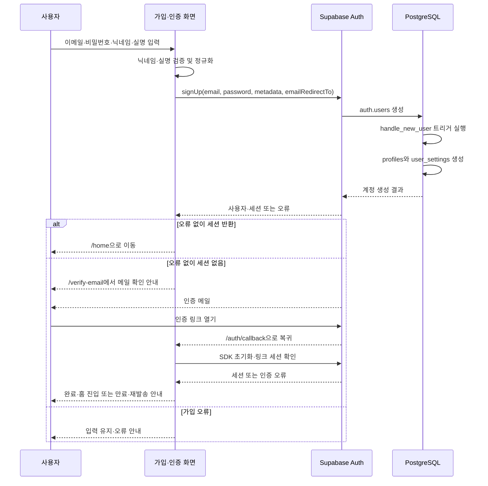
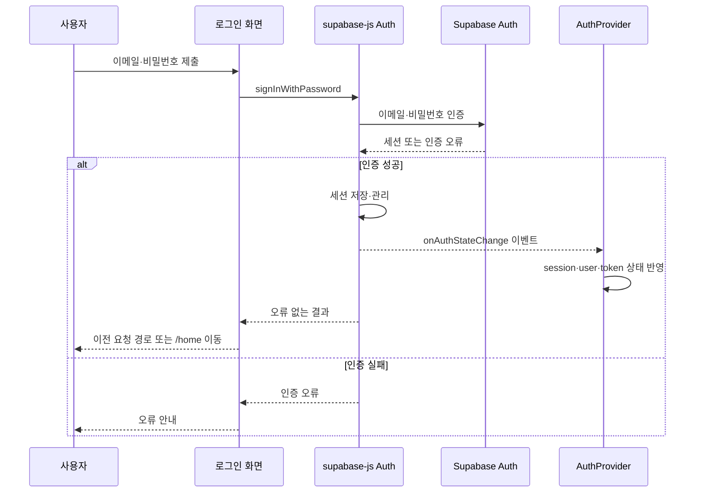
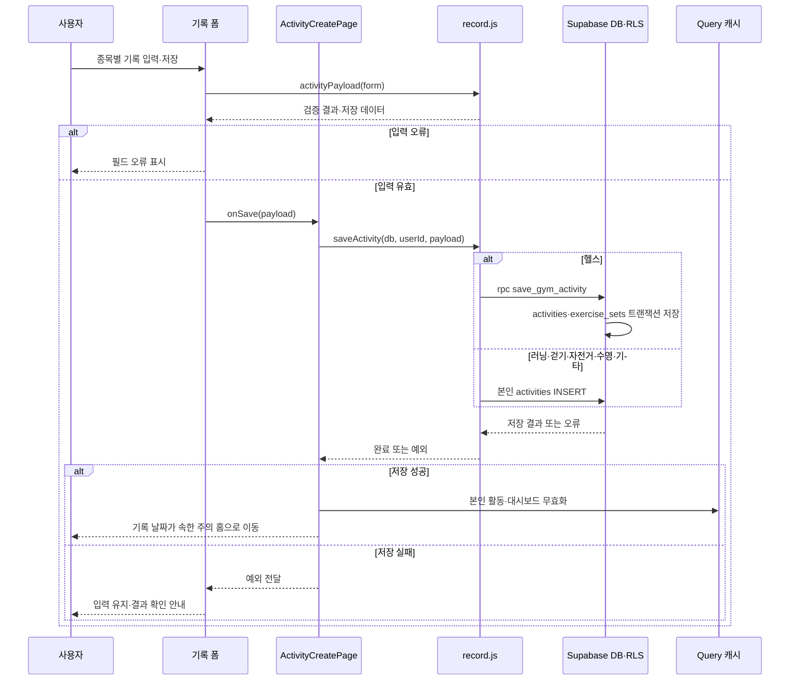
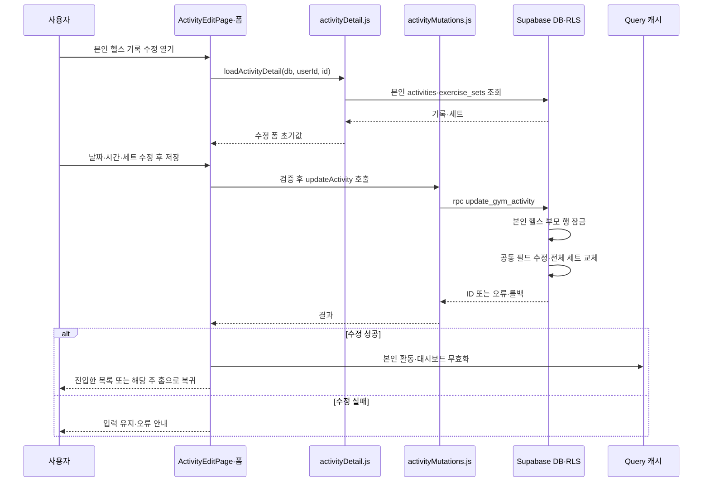
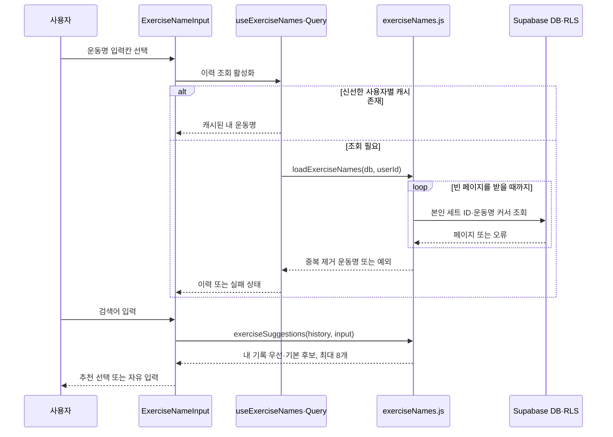
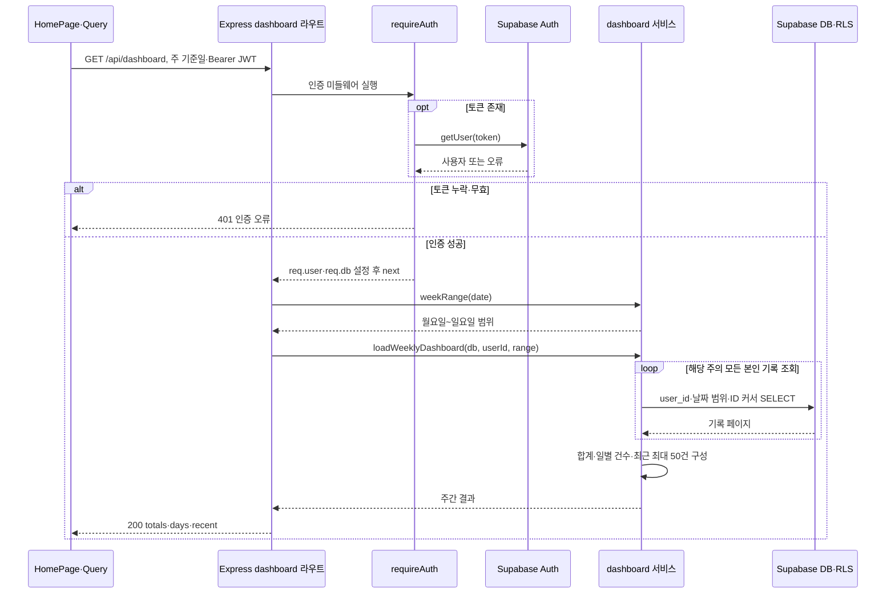
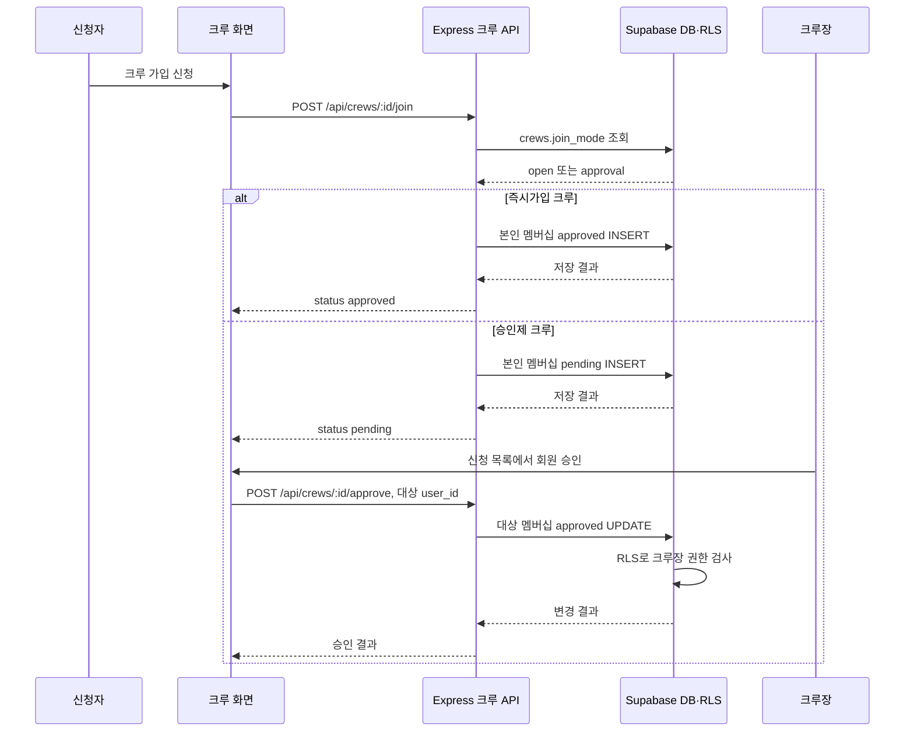
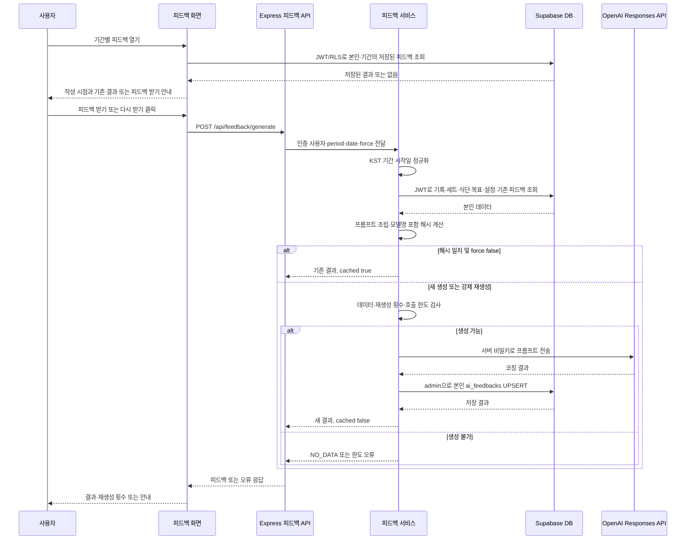

# CrewFit 순차 다이어그램

기준일: 2026-09-21. [설계 결정](decisions.md), [API 명세](api.md), 현재 소스 코드를 근거로 작성한 주요 유스케이스의 상호작용이다. 전체 화면·예외를 나열한 문서는 아니다.

- **구현 기준**: 저장소에서 호출 경로를 확인한 흐름. 실제 배포 환경의 검증 완료를 뜻하지 않는다.
- **설계 기준**: 확정된 ADR·API 계약에 따른 흐름. 해당 화면·Express API는 아직 미구현이다.
- `->>`는 요청·호출, `-->>`는 응답이다. JWT는 사용자 세션의 접근 토큰을 뜻한다.
- Mermaid를 지원하는 Markdown 뷰어에서 각 코드 블록을 그림으로 볼 수 있다. FigJam 전용 렌더러가 아닌 일반 Mermaid 기준이므로 `alt`, `loop`로 분기·반복을 표현한다.
- 클래스·관계는 [클래스 다이어그램](class-diagrams.md), 최신 작업 상태는 [decisions.md](decisions.md)의 진행 상황을 참조한다.

## 1. 회원가입 — 구현 기준

참여자: 사용자, 가입·인증 화면, Supabase Auth, PostgreSQL. D-12의 이메일 확인 ON에 따라 가입 요청 후 메일 링크로 인증하는 경로다.

- 닉네임은 공개 카드 `profiles`, 실명은 비공개 `user_settings.real_name`에 저장한다(D-25·D-28).
- 폼에서는 실명이 필수지만 트리거는 실명 없는 관리자 생성 등을 허용해 NULL을 저장한다.
- 근거: [SignupPage.jsx](../../client/src/features/auth/SignupPage.jsx), [schema.sql](../../server/config/schema.sql)의 `handle_new_user`.

## 2. 로그인·세션 반영 — 구현 기준

로그인 자체는 Express를 거치지 않는다. 보호된 Express API를 호출할 때 별도로 JWT 검증을 수행한다(6절).

새로고침 시 `getSession()`으로 세션을 복원한다. 로그아웃 이벤트에서는 Query 캐시를 비운다(D-13). 위 그림은 성공 경로를 읽기 쉽게 펼친 것으로, SDK 이벤트와 호출 Promise의 세부 실행 순서를 애플리케이션이 강제하는 것은 아니다.

근거: [LoginPage.jsx](../../client/src/features/auth/LoginPage.jsx), [AuthContext.jsx](../../client/src/features/auth/AuthContext.jsx).

## 3. 운동 기록 생성 — 구현 기준

일반 종목은 단일 테이블 INSERT, 헬스는 기록과 세트를 묶는 RPC다. 두 경로 모두 사용자 JWT·RLS를 적용하며 Express를 거치지 않는다(D-10·D-22).

- 시간은 `분 × 60 + 초`, 야외 거리는 km → m로 변환한다. 수영 거리는 m, 선택 랩 수는 `details.lap_count`다.
- 헬스 RPC가 실패하면 기록·세트 모두 롤백된다. 일반 종목도 오류를 성공으로 처리하지 않는다.
- 근거: [ActivityForm.jsx](../../client/src/features/activities/ActivityForm.jsx), [ActivityCreatePage.jsx](../../client/src/features/activities/ActivityCreatePage.jsx), [record.js](../../client/src/features/activities/record.js), [schema.sql](../../server/config/schema.sql).

## 4. 헬스 기록 수정 — 구현 기준

본인 기록을 조회해 폼에 채운 뒤 저장하는 경로다. 그림의 DB 참여자는 사용자 JWT로 접근하는 Supabase DB이며, 수정 RPC는 `security invoker`로 RLS를 따른다.

종목·소유자는 변경할 수 없다. 없는 기록·타인 기록은 편집 폼을 열지 않는다. RPC 안에서 부모가 없거나 본인 헬스 기록이 아니면 `P0002`, 함수 미적용이면 클라이언트가 `PGRST202` 안내를 표시한다.

근거: [ActivityEditPage.jsx](../../client/src/features/activities/ActivityEditPage.jsx), [activityDetail.js](../../client/src/features/activities/activityDetail.js), [activityMutations.js](../../client/src/features/activities/activityMutations.js), [수정 RPC](../../server/config/migrations/20260914_update_gym_activity.sql).

## 5. 헬스 운동명 자동완성 — 구현 기준

내 기록을 먼저 추천하고 정적 기본 운동 30개를 보완 후보로 사용한다. 운동 마스터 테이블이나 LLM 호출은 없다(D-05).

오류가 나면 반복 조회를 중단하고 기본 추천·직접 입력을 유지한다. 키는 `['activities', userId, 'exerciseNames']`, staleTime은 5분이다. DB 조회 중에도 정적 추천을 사용할 수 있다.

근거: [useExerciseNames.js](../../client/src/features/activities/useExerciseNames.js), [exerciseNames.js](../../client/src/features/activities/exerciseNames.js), [ExerciseNameInput.jsx](../../client/src/features/activities/ExerciseNameInput.jsx).

## 6. 주간 대시보드 조회 — 구현 기준

캐시 조회가 아니라 서버 요청이 필요한 경우의 흐름이다. 집계는 Express에서 수행하지만 DB 권한은 사용자 JWT·RLS다. `service_role`은 사용하지 않는다(D-15).

잘못된 기간·날짜는 400, 조회 실패는 500이다. 일부만 읽은 합계를 성공 응답으로 반환하지 않는다. 현재 그림에는 후속 기능인 스트릭·목표 달성률을 넣지 않았다.

근거: [HomePage.jsx](../../client/src/features/dashboard/HomePage.jsx), [auth.js](../../server/middleware/auth.js), [routes/dashboard.js](../../server/routes/dashboard.js), [services/dashboard.js](../../server/services/dashboard.js).

## 7. 크루 가입 신청·승인 — 설계 기준

D-17 및 API 명세의 구현 예정 흐름이다. 각 Express 요청의 `requireAuth` 검증은 6절과 동일하며 그림에서는 생략했다. 신청자 요청은 신청자 JWT, 승인 요청은 크루장 JWT를 사용한다.

- INSERT도 RLS가 가입 모드·본인 여부를 검사한다. 승인은 크루장만 가능하며 `can_post` 부여와는 별개다.
- 거절은 `/reject`를 통해 신청 행을 삭제한다. 권한 거부는 API 계약상 403이다.
- 근거: [api.md](api.md)의 멤버십 계약, [decisions.md](decisions.md) D-17, [schema.sql](../../server/config/schema.sql)의 `crew_members` 정책. 크루 라우트 구현 완료를 뜻하지 않는다.

## 8. 기간별 AI 피드백 — 구현 기준

D-06·D-07·D-15·D-29의 구현 흐름이다. 인증 성공 이후부터 표현한다. 읽기는 사용자 JWT, 결과 쓰기만 서버 전용 admin 권한이다.

- 저장 user_id는 요청 본문이 아니라 인증된 `req.user.id`다. admin 키·LLM 키는 클라이언트에 전달하지 않는다.
- 강제 재생성은 기간당 3회, 실제 LLM 호출은 사용자당 분당 5회·일일 20회로 제한하는 설계다. 호출 제한은 단일 서버의 메모리 기반이며 재시작하면 초기화된다.
- 기록 없음은 400 `NO_DATA`, 한도 초과는 429다. 설정 누락·모델 통신·저장 실패는 서로 다른 안정된 오류 코드로 응답하며 내부 오류와 비밀값은 노출하지 않는다.
- 근거: [FeedbackPage.jsx](../../client/src/features/feedback/FeedbackPage.jsx), [feedback.js](../../server/services/feedback.js), [llm.js](../../server/services/llm.js), [api.md](api.md), [decisions.md](decisions.md) D-06·D-07·D-15·D-29.
